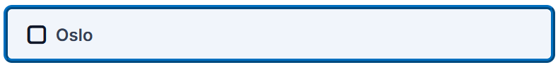

# Button

The button component has three variants: Primary, Secondary and Navigation

## Primary

**Use case:** Main action like Check, Submit, Show results

Primary buttons have a filled in background, contrasting text, and an icon that only appears on hover.

| State   | Appearance                                                                                               |
| ------- | -------------------------------------------------------------------------------------------------------- |
| Default | 
<figure><figcaption></figcaption></figure>
     |
| Hover   | 
<figure><figcaption></figcaption></figure>
 |
| Focus   | 
<figure><figcaption></figcaption></figure>
 |
| Active  | 
<figure><figcaption></figcaption></figure>
 |

### Variables

| Attribute        | Variable                                               |
| ---------------- | ------------------------------------------------------ |
| Text color       | --h5p-theme-contrast-cta                               |
| Background color | --h5p-theme-main-cta-base                              |
| Padding          | var(--h5p-theme-spacing-xs) var(--h5p-theme-spacing-l) |

## Secondary

## Navigation

